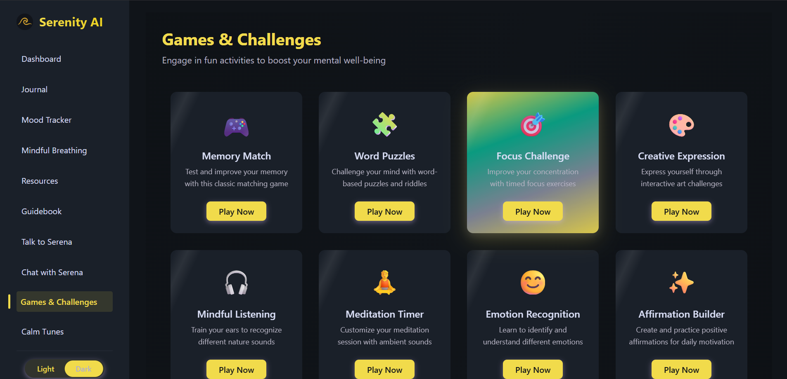

# Serenity AI

Serenity AI is a modern and intuitive mental wellness web application that seamlessly blends AI technology with holistic self-care tools. Built with React.js and Firebase, Serenity AI empowers users to enhance their emotional well-being through journaling, mood tracking, guided meditation, relaxing music, games, and both text and voice-based AI support.

**Live Demo:** [https://the-serenity-ai.vercel.app/](https://the-serenity-ai.vercel.app/)

---

## Table of Contents

* [Features](#features)
* [Screenshots](#screenshots)
* [Tech Stack](#tech-stack)
* [Getting Started](#getting-started)

  * [Prerequisites](#prerequisites)
  * [Installation](#installation)
  * [Running Locally](#running-locally)
  * [Environment Variables](#environment-variables)
* [Project Structure](#project-structure)
* [Usage Guide](#usage-guide)
* [More screenshots](#more-screenshots)
* [License](#license)

---

## Features

* **Dashboard:** Central hub with quick access to all features and motivational content.
* **Journal:** Securely write and store daily reflections, with AI-generated insights.
* **Mood Tracker:** Log emotional states and visualize mood trends.
* **Guidebook & Resources:** Curated wellness guides, articles, and self-help content.
* **Mindful Breathing:** Interactive breathing exercises to reduce stress.
* **Calm Tunes:** Curated playlists of nature sounds, meditation music, and sleep aids.
* **Games & Challenges:** Engaging activities like emotion puzzles, affirmation games, and mindful listening tasks.
* **AI Chat Assistant (Serena):** Smart, text-based AI support.
* **Voice Assistant (Comfort Zone):** Talk to the AI for spoken support and comfort.
* **Personalization:** Toggle dark/light mode and manage account settings.
* **Secure Authentication:** Google Sign-in via Firebase.
* **Responsive Design:** Works beautifully on both desktop and mobile.

---

## Screenshots





---

## Tech Stack

* **Frontend:** React 18, Vite, React Router, SCSS/Sass, TailwindCSS
* **Backend & Auth:** Firebase (Firestore, Auth)
* **AI Integration:** Google Generative AI (Gemini)
* **Hosting & Deployment:** Vercel
* **Design:** Responsive UI, dark/light mode toggle, animated transitions
* **Other Tools:** ESLint, Prettier

---

## Getting Started

### Prerequisites

* Node.js (v16+)
* npm
* Firebase project setup (Firestore & Authentication enabled)
* (Optional) Vercel account for deployment

### Installation

1. Clone the repository:

```bash
git clone https://github.com/pranav-c-r/Serenity-AI.git
cd Serenity-AI
```

2. Install dependencies:

```bash
npm install
```

### Running Locally

```bash
npm run dev
```

App will run at: [http://localhost:5173](http://localhost:5173)

### Environment Variables

Create a `.env` file in the root directory:

```env
VITE_FIREBASE_API_KEY=your_api_key
VITE_GEMINI_API_KEY=your_gemini_api_key
REACT_APP_YOUTUBE_API_KEY=your_youtube_api_key
```

---

## Project Structure

```
Serenity-AI/
├── public/
├── src/
│   ├── assets/
│   ├── components/
│   ├── context/
│   ├── pages/
│   ├── services/
│   ├── config/
│   ├── utils/
│   ├── hooks/
│   ├── App.jsx
│   ├── main.jsx
│   └── main.scss
├── .env
├── package.json
├── vite.config.js
└── README.md
```

---

## Usage Guide

* Sign in using Google.
* Use the sidebar for navigation.
* Write journal entries and receive AI feedback.
* Track your mood and review analytics.
* Use the breathing tool to relax.
* Listen to calming sounds through Calm Tunes.
* Play games to boost focus and emotional awareness.
* Talk or chat with Serena for mental support.

---

**Live Demo:** [https://the-serenity-ai.vercel.app/](https://the-serenity-ai.vercel.app/)

---

## More Screenshots


with 💖, TEAM DE4DSCOPE

---

## License

This project is licensed under the MIT License.

---
